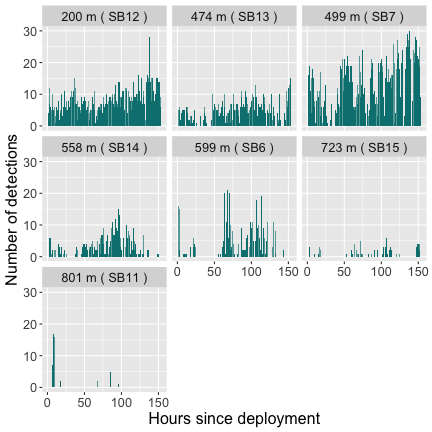
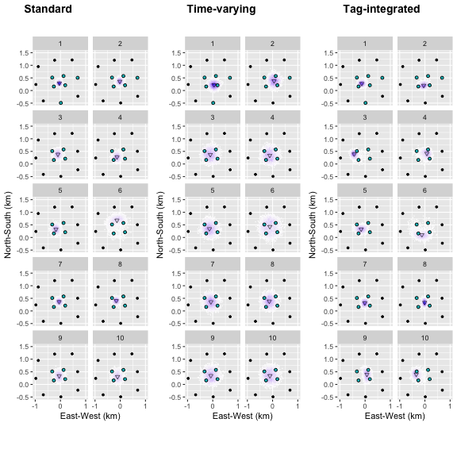

# Estimate activity centers from acoustic telemetry data

## Introduction

This vignette will walk you through the analyses presented in Winton et
al. 2018, who describe the use of spatial point process models to
estimate individual centers of activity from passive acoustic telemetry
data. The vignette progresses from applying the simplest case, which
assumes that detection probabilities/receiver detection ranges remain
constant over time, to application of a test-tag integrated model, which
incorporates detection data from one or more stationary test
transmitters to estimate time-varying detection ranges. The models are
fitted in a Bayesian framework using the Stan software (Carpenter et
al. 2017); code was modified from that provided in Royle et al. 2013 for
fitting spatial point process models to data from camera traps. We
prefer the Bayesian approach for COA estimation due to its treatment of
uncertainty, but realize the longer computational time required may be
prohibitive for some applications. In the near future, we will update to
include an option to fit in a maximum likelihood framework, which will
reduce run times. We’d also like to note that the models described can
support varying degrees of complexity - not all applications will
require (or have the data to support) the most complex version of the
model. The simpler the model, the shorter the run-time.

We realize that many users will have unique situations and may need to
modify the base code to suit their purposes. Users can copy the `.stan`
files contained in the `src/stan_files` folder to their local machine to
do so. We will be happy to accommodate user requests (as our schedules
allow). Our hope is to make this a collaborative package that will
evolve based on the needs of the acoustic telemetry community and
continue to improve over time. We have tried to make the instructions
outlined in this vignette user-friendly since we are a group of applied
biologists with varying degrees of statistical experience. If some of
the statistical notation outlined here or in the paper remains unclear,
feel free to contact us with questions/for clarification. Most of it is
actually very intuitive, and we would like to make sure that comes
through in the documentation. This is a new package, so if you find
bugs, places where code efficiency could be improved, or instances where
the documentation could be made more user-friendly, please let us know!

## Data preparation

The package includes two data sets:

1.  153 hours of detection data from a black sea bass (note that we have
    assigned time as the number of cumulative hours since the tag was
    deployed rather than providing the raw date/time stamp), and
2.  hourly detections from a stationary test transmitter over the same
    time period. Two files containing the receiver coordinates and the
    location of the test tag are also included. We have provided the
    data in this format to illustrate data preparation specific to
    fitting these types of models; however, you will need to aggregate
    your date/time stamps to the time period of interest. Receiver and
    test tag coordinates provided are in the Universal Transverse
    Mercator (zone 18) projection, which have previously been
    mean-centered and scaled into kilometers. *This scaling step is
    highly recommended to reduce run-times. In other words, do it to
    your dataset prior to starting the code chunks here.*

To access the provided data, run:

``` r

library(TelemetrySpace)
library(dplyr)
library(tidyr)
library(ggplot2)
library(hexbin)
library(ggpubr)

rlocs # Receiver locations
#> # A tibble: 30 × 3
#>    Station   east  north
#>    <chr>    <dbl>  <dbl>
#>  1 SB1     -1.33  1.61  
#>  2 SB2     -0.579 1.91  
#>  3 SB3      0.219 2.00  
#>  4 SB4      1.00  1.81  
#>  5 SB5     -1.69  0.896 
#>  6 SB6     -0.879 0.950 
#>  7 SB7     -0.231 1.20  
#>  8 SB8      0.464 1.21  
#>  9 SB9      1.28  1.04  
#> 10 SB10    -1.77  0.0952
#> # ℹ 20 more rows
testloc # Test tag location
#> # A tibble: 1 × 2
#>     east north
#>    <dbl> <dbl>
#> 1 -0.329 0.713
head(testdat) # Hourly detection data from the test tag
#> # A tibble: 6 × 5
#>   Station Transmitter   east north  hour
#>   <chr>         <dbl>  <dbl> <dbl> <dbl>
#> 1 SB12           3447 -0.326 0.513     1
#> 2 SB13           3447  0.125 0.575     1
#> 3 SB7            3447 -0.231 1.20      1
#> 4 SB6            3447 -0.879 0.950     1
#> 5 SB13           3447  0.125 0.575     1
#> 6 SB6            3447 -0.879 0.950     1
head(fishdat) # Hourly detection data from a black sea bass
#> # A tibble: 6 × 5
#>   Station Transmitter   east north  hour
#>   <chr>         <dbl>  <dbl> <dbl> <dbl>
#> 1 SB15           3425  0.190 0.209     1
#> 2 SB14           3425 -0.261 0.159     1
#> 3 SB15           3425  0.190 0.209     1
#> 4 SB14           3425 -0.261 0.159     1
#> 5 SB12           3425 -0.326 0.513     1
#> 6 SB14           3425 -0.261 0.159     1
```

Prior to doing anything else, we need to specify our ‘state space’ - the
spatial extent of interest. This will consist of your receiver array and
a ‘buffer’ area around the array. The buffer needs to be large enough to
allow for individuals that may have activity centers outside of the
receiver array. There is no general rule of thumb for this, but it
should scale with the geographic extent covered by your array. I would
suggest selecting a buffer that is large enough to allow you to
discriminate between individuals that are detected along the periphery
of the array and individuals that are not detected at all - a COA will
be estimated for all time steps unless you specify the individual has
left the area; time steps with 0 detections will have an estimated COA
somewhere outside the detection range of all receivers (note that this
could be within the array bounds if your array has non-continuous
coverage). If there are many time steps with zeros, you may want to
modify your data file to omit time periods with 0 detections or modify
the relevant `.stan` code chunk included in the `src/stan_files` folder
on your local machine to skip time periods with no detections, which
will speed up computing times. As always, it is up to the user to make
sure that the results make sense in the context of the species/array of
interest.

``` r

# Define state-space of point process - 'buffer' adds a fixed buffer to the outer extent of the recs
buffer <- 1
xlim <- c(min(rlocs$east - buffer), max(rlocs$east + buffer))
ylim <- c(min(rlocs$north - buffer), max(rlocs$north + buffer))
```

Next, we need to prepare our test tag data. First, calculate the
distance between the test tag’s location and each receiver. This can be
done using the included ‘distf’ function.

``` r

# Set up a blank vector for storage
D <- NULL
# Loop over each hour
for (i in 1:nrow(testdat)) {
  D[i] <- distf(testloc[, c('east', 'north')], testdat[i, c('east', 'north')])
}

testdat$D <- unlist(D) # Assign to testdat data frame

# Plot to examine variation in detection rate over time
testdat |>
  count(Station, hour, D, east, north) |>
  mutate(
    dist = round(D * 1000), #Round distance for plotting
    label = paste(dist, "m", "(", Station, ")") #Create label by merging station name and distance
  ) |>

  #Plot using ggplot
  ggplot(aes(x = hour, y = n)) +
  geom_bar(stat = "identity", fill = '#008080') +
  facet_wrap(~ as.factor(label)) +
  theme(text = element_text(size = 16)) +
  scale_y_continuous(breaks = seq(0, 30, 10)) +
  labs(x = "Hours since deployment", y = "Number of detections")
```



Tally how many time intervals each receiver was operational for - this
allows for individual receivers deployed for different periods and/or
receivers that were lost.

``` r

# The full analysis takes several hours to run, so we'll subset out 10 hours to illustrate
fishdat <- fishdat |>
  filter(hour < 11)
testdat <- testdat |>
  filter(hour < 11)

# Create a copy of the receiver locations for tallying
rs <- rlocs

# Add column for each time interval to indicate whether receiver was operational or not
rs[, c(4:(max(fishdat$hour) + 3))] <- 1

# Create vector of the number of sampling occasions for each receiver
tsteps <- rowSums(rs[, 4:ncol(rs)])
tsteps # Will all be the same here because all operational over the entire time span
#>  [1] 10 10 10 10 10 10 10 10 10 10 10 10 10 10 10 10 10 10 10 10 10 10 10 10 10 10 10 10 10 10
```

Since detection records only include non-zero events (here assuming we’d
like to keep time steps with zeros), we’ll need to convert the number of
detections to include zeros for all receivers that did not detect the
tag during that time period.

``` r

## Starting with the test tag data
test_agg <- testdat |>
  mutate(
    rec = as.numeric(substr(Station, 3, 4)),
    # Add a column that indicates each record corresponds to 1 detection
    count = 1
  ) |>

  # Aggregate the number of detections for each individual at each receiver
  # in each time step
  count(Transmitter, rec, east, north, hour) |>

  # Create a numeric identifier for each transmitter
  mutate(tag = as.numeric(as.factor(Transmitter))) |>

  # Rename hour to time for consistency when plotting below
  rename(time = "hour")

# Specify quantities for indexing
#   number of individual tags (here just the one test tag)
ntest <- length(unique(test_agg$Transmitter))

#   number of receivers
nrec <- nrow(rlocs)

#   number of time steps
tsteps <- max(test_agg$time)

# This chunk saves the total number of encounters of each individual (rows) in
# each trap (cols) at each sampling occasion (array elements)
testY <- array(NA, dim = c(ntest, tsteps, nrec))

for (t in 1:tsteps) {
  for (i in 1:ntest) {
    h1 <- test_agg[test_agg$tag == i, ]

    for (j in 1:nrec) {
      testY[i, t, j] <- ifelse(
        # If there are no detections at that receiver in that time period, set to 0
        nrow(h1[h1$time == t & h1$rec == j, ]) == 0,
        0,

        # otherwise set to the number of detections
        h1[h1$time == t & h1$rec == j, ]$n
      )
    }
  }
}
```

Now we’ll do the same thing for the black sea bass detection data.

``` r

## Now do the same for each tagged fish
fish_agg <- fishdat |>
  mutate(
    rec = as.numeric(substr(Station, 3, 4)),
    # Add a column that indicates each record corresponds to 1 detection
    count = 1
  ) |>

  # Aggregate the number of detections for each individual at each receiver
  # in each time step
  count(Transmitter, rec, east, north, hour) |>

  # Create a numeric identifier for each transmitter
  mutate(tag = as.numeric(as.factor(Transmitter))) |>

  # Rename hour to time for consistency when plotting below
  rename(time = "hour")

# Specify quantities for indexing
#   number of individual tags (here just the one test tag)
nind <- length(unique(fish_agg$Transmitter))

# This chunk saves the total number of encounters of each individual (rows) in each trap (cols) at each sampling occasion (array elements)
Y <- array(NA, dim = c(nind, tsteps, nrec))

for (t in 1:max(tsteps)) {
  for (i in 1:nrow(Y)) {
    h1 <- fish_agg[fish_agg$tag == i, ]

    for (j in 1:nrow(rlocs)) {
      # If there are no detections at that receiver in that time period, set to 0; otherwise set to the number of detections
      Y[i, t, j] <- ifelse(
        # If there are no detections at that receiver in that time period, set to 0
        nrow(h1[h1$time == t & h1$rec == j, ]) == 0,
        0,

        # otherwise set to the number of detections
        h1[h1$time == t & h1$rec == j, ]$n
      )
    }
  }
}
```

We also want to make sure that our intial values of the COAs are
realistic (somewhere within the array).

``` r

init_fun <- function() {
  list(
    sx = matrix(mean(rlocs$east), nrow = nind, ncol = tsteps),
    sy = matrix(mean(rlocs$north), nrow = nind, ncol = tsteps)
  )
}
```

## Fit the standard COA model

After all of that data processing, we’re finally ready to fit our model!
We’ll start by fitting the model assuming that detection probabilities
are the same among all receivers and remain constant over time (As we
all know, this will pretty much never be the case in ‘real-life’ but
best to start simple). Besides, this model is handy when you don’t have
test-tag (or other) data available to inform detection probabilities but
would like to be able to estimate COAs along the periphery of the array.
The only other information you’ll need to provide is the expected number
of transmissions per tag per time interval (`ntrans` below).

``` r

### Format data for model fitting
fit <- COA_Standard(
  nind = nind, # number of individuals
  nrec = nrec, # number of receivers
  ntime = tsteps, # number of time steps
  ntrans = 30, # number of expected transmissions per tag per time interval
  y = Y, # array of detections
  recX = as.vector(rlocs$east), # E-W receiver coordinates
  recY = as.vector(rlocs$north), # N-S receiver coordinates
  xlim = xlim, # E-W boundary of spatial extent (receiver array + buffer)
  ylim = ylim, # N-S boundary of spatial extent (receiver array + buffer)
  init = init_fun # initial values (optional)
)
#> 
#> SAMPLING FOR MODEL 'COA_Standard_gaussian' NOW (CHAIN 1).
#> Chain 1: 
#> Chain 1: Gradient evaluation took 0.000665 seconds
#> Chain 1: 1000 transitions using 10 leapfrog steps per transition would take 6.65 seconds.
#> Chain 1: Adjust your expectations accordingly!
#> Chain 1: 
#> Chain 1: 
#> Chain 1: Iteration:    1 / 2000 [  0%]  (Warmup)
#> Chain 1: Iteration:  200 / 2000 [ 10%]  (Warmup)
#> Chain 1: Iteration:  400 / 2000 [ 20%]  (Warmup)
#> Chain 1: Iteration:  600 / 2000 [ 30%]  (Warmup)
#> Chain 1: Iteration:  800 / 2000 [ 40%]  (Warmup)
#> Chain 1: Iteration: 1000 / 2000 [ 50%]  (Warmup)
#> Chain 1: Iteration: 1001 / 2000 [ 50%]  (Sampling)
#> Chain 1: Iteration: 1200 / 2000 [ 60%]  (Sampling)
#> Chain 1: Iteration: 1400 / 2000 [ 70%]  (Sampling)
#> Chain 1: Iteration: 1600 / 2000 [ 80%]  (Sampling)
#> Chain 1: Iteration: 1800 / 2000 [ 90%]  (Sampling)
#> Chain 1: Iteration: 2000 / 2000 [100%]  (Sampling)
#> Chain 1: 
#> Chain 1:  Elapsed Time: 5.911 seconds (Warm-up)
#> Chain 1:                4.889 seconds (Sampling)
#> Chain 1:                10.8 seconds (Total)
#> Chain 1: 
#> 
#> SAMPLING FOR MODEL 'COA_Standard_gaussian' NOW (CHAIN 2).
#> Chain 2: 
#> Chain 2: Gradient evaluation took 0.000611 seconds
#> Chain 2: 1000 transitions using 10 leapfrog steps per transition would take 6.11 seconds.
#> Chain 2: Adjust your expectations accordingly!
#> Chain 2: 
#> Chain 2: 
#> Chain 2: Iteration:    1 / 2000 [  0%]  (Warmup)
#> Chain 2: Iteration:  200 / 2000 [ 10%]  (Warmup)
#> Chain 2: Iteration:  400 / 2000 [ 20%]  (Warmup)
#> Chain 2: Iteration:  600 / 2000 [ 30%]  (Warmup)
#> Chain 2: Iteration:  800 / 2000 [ 40%]  (Warmup)
#> Chain 2: Iteration: 1000 / 2000 [ 50%]  (Warmup)
#> Chain 2: Iteration: 1001 / 2000 [ 50%]  (Sampling)
#> Chain 2: Iteration: 1200 / 2000 [ 60%]  (Sampling)
#> Chain 2: Iteration: 1400 / 2000 [ 70%]  (Sampling)
#> Chain 2: Iteration: 1600 / 2000 [ 80%]  (Sampling)
#> Chain 2: Iteration: 1800 / 2000 [ 90%]  (Sampling)
#> Chain 2: Iteration: 2000 / 2000 [100%]  (Sampling)
#> Chain 2: 
#> Chain 2:  Elapsed Time: 6.485 seconds (Warm-up)
#> Chain 2:                5.096 seconds (Sampling)
#> Chain 2:                11.581 seconds (Total)
#> Chain 2: 
#> 
#> SAMPLING FOR MODEL 'COA_Standard_gaussian' NOW (CHAIN 3).
#> Chain 3: 
#> Chain 3: Gradient evaluation took 0.000527 seconds
#> Chain 3: 1000 transitions using 10 leapfrog steps per transition would take 5.27 seconds.
#> Chain 3: Adjust your expectations accordingly!
#> Chain 3: 
#> Chain 3: 
#> Chain 3: Iteration:    1 / 2000 [  0%]  (Warmup)
#> Chain 3: Iteration:  200 / 2000 [ 10%]  (Warmup)
#> Chain 3: Iteration:  400 / 2000 [ 20%]  (Warmup)
#> Chain 3: Iteration:  600 / 2000 [ 30%]  (Warmup)
#> Chain 3: Iteration:  800 / 2000 [ 40%]  (Warmup)
#> Chain 3: Iteration: 1000 / 2000 [ 50%]  (Warmup)
#> Chain 3: Iteration: 1001 / 2000 [ 50%]  (Sampling)
#> Chain 3: Iteration: 1200 / 2000 [ 60%]  (Sampling)
#> Chain 3: Iteration: 1400 / 2000 [ 70%]  (Sampling)
#> Chain 3: Iteration: 1600 / 2000 [ 80%]  (Sampling)
#> Chain 3: Iteration: 1800 / 2000 [ 90%]  (Sampling)
#> Chain 3: Iteration: 2000 / 2000 [100%]  (Sampling)
#> Chain 3: 
#> Chain 3:  Elapsed Time: 6.557 seconds (Warm-up)
#> Chain 3:                7.947 seconds (Sampling)
#> Chain 3:                14.504 seconds (Total)
#> Chain 3: 
#> 
#> SAMPLING FOR MODEL 'COA_Standard_gaussian' NOW (CHAIN 4).
#> Chain 4: 
#> Chain 4: Gradient evaluation took 0.000534 seconds
#> Chain 4: 1000 transitions using 10 leapfrog steps per transition would take 5.34 seconds.
#> Chain 4: Adjust your expectations accordingly!
#> Chain 4: 
#> Chain 4: 
#> Chain 4: Iteration:    1 / 2000 [  0%]  (Warmup)
#> Chain 4: Iteration:  200 / 2000 [ 10%]  (Warmup)
#> Chain 4: Iteration:  400 / 2000 [ 20%]  (Warmup)
#> Chain 4: Iteration:  600 / 2000 [ 30%]  (Warmup)
#> Chain 4: Iteration:  800 / 2000 [ 40%]  (Warmup)
#> Chain 4: Iteration: 1000 / 2000 [ 50%]  (Warmup)
#> Chain 4: Iteration: 1001 / 2000 [ 50%]  (Sampling)
#> Chain 4: Iteration: 1200 / 2000 [ 60%]  (Sampling)
#> Chain 4: Iteration: 1400 / 2000 [ 70%]  (Sampling)
#> Chain 4: Iteration: 1600 / 2000 [ 80%]  (Sampling)
#> Chain 4: Iteration: 1800 / 2000 [ 90%]  (Sampling)
#> Chain 4: Iteration: 2000 / 2000 [100%]  (Sampling)
#> Chain 4: 
#> Chain 4:  Elapsed Time: 6.435 seconds (Warm-up)
#> Chain 4:                7.027 seconds (Sampling)
#> Chain 4:                13.462 seconds (Total)
#> Chain 4: 
#>         warmup sample
#> chain:1  5.911  4.889
#> chain:2  6.485  5.096
#> chain:3  6.557  7.947
#> chain:4  6.435  7.027
```

The function will automatically spit out the run-time associated with
each of the 4 chains used for fitting and returns a list with four
objects:

``` r

summary(fit)
#>                      Length Class         Mode   
#> model                 1     stanfit       S4     
#> summary              20     -none-        numeric
#> time                  1     -none-        numeric
#> summary_draws         4     draws_summary list   
#> coas                  8     tbl_df        list   
#> all_estimates        28     draws_df      list   
#> loc_draws             8     tbl_df        list   
#> param_draws          10     tbl_df        list   
#> generated_quantities  1     -none-        list
```

The first contains the Stan model object (accessible via `fit$model`,
which will allow you to use `rstan` plotting tools and diagnostic
plots - see rstan documentation for details).

The second element is a table of parameter estimates and associated
quantiles from the posterior distribution. The table also includes the
effective sample size and the Rhat statistic (which should be ~1).

``` r

fit$summary
#>            mean      se_mean         sd      2.5%       25%       50%       75%     97.5%    n_eff      Rhat
#> p0    0.2654382 0.0003688420 0.02189836 0.2243499 0.2505072 0.2647295 0.2798553 0.3110876 3524.867 0.9997398
#> sigma 0.2732326 0.0002651498 0.01443172 0.2452476 0.2636036 0.2731982 0.2827502 0.3023710 2962.468 0.9995877
```

The third returns the time required to run the model (in minutes). Note
that Stan will automatically detect and use multiple cores. If the
computer used to run this has multiple cores, the time returned will be
longer than the actual run time (because it will sum the time for each
core). To return the realized run time, divide `fit$time` by the number
of cores.

``` r

fit$time
#> [1] 0.8391167
```

The fourth returns an array of COA estimates, where each matrix
corresponds to one individual, the rows correspond to each time step,
and the columns include the median posterior estimate of the east-west
(x) and north-south (y) coordinates. The 95% credible interval (Bayesian
version of a confidence interval) for each coordinate is also provided.

``` r

fit$coas
#> # A tibble: 10 × 8
#>      ind  time       x     y x_lower x_upper y_lower y_upper
#>    <int> <int>   <dbl> <dbl>   <dbl>   <dbl>   <dbl>   <dbl>
#>  1     1     1 -0.0417 0.291  -0.147  0.0601  0.183    0.407
#>  2     1     2 -0.0186 0.360  -0.147  0.114   0.217    0.499
#>  3     1     3 -0.100  0.383  -0.262  0.0610  0.182    0.577
#>  4     1     4 -0.127  0.280  -0.288  0.0327  0.106    0.481
#>  5     1     5 -0.177  0.326  -0.340 -0.0201  0.142    0.524
#>  6     1     6 -0.131  0.681  -0.470  0.181   0.0955   0.880
#>  7     1     7 -0.0527 0.365  -0.174  0.0749  0.230    0.501
#>  8     1     8 -0.159  0.405  -0.287 -0.0310  0.264    0.539
#>  9     1     9 -0.0502 0.337  -0.224  0.123   0.118    0.551
#> 10     1    10 -0.108  0.306  -0.309  0.0921  0.0856   0.573
```

The last element (`fit$all_estimates`) contains the estimates from each
non-warm-up iteration for all 4 chains. (If you’re not familiar with
Bayesian lingo and this just seems like statistical jargon, all you need
to know is that this is what you’ll use to plot the uncertainty cloud
around COA estimates and/or the distribution of parameter estimates as
presented in the paper.) This includes estimates of all latent
parameters for each individual in each time step (aka this element
contains tons of parameter estimates), so we will need to subset out
parameters for plotting.

``` r

# Extract east-west and north-south coordinates of COAs from each iteration of each chain
# Note that 'sx' and 'sy' are the variable names used to store the coordinates for each individual (rows) in each time step (columns).
# We'll store them as a list, where each element corresponds to an individual
EN_fit <- list(NA)

for (i in 1:nind) {
  EN_fit[[i]] <- bind_cols(
    # East-West
    fit$all_estimates |>
      select(starts_with(paste("sx[", i, ",", sep = ''))) |>
      pivot_longer(everything(), values_to = "X"),
    # North-South
    fit$all_estimates |>
      select(starts_with(paste("sy[", i, ",", sep = ''))) |>
      pivot_longer(everything(), values_to = "Y") |>
      select(Y)
  ) |>
    # The ID field corresponds to the time step.
    mutate(time = as.numeric(gsub(".*,|\\]", "", name)))
}
#> Warning: Dropping 'draws_df' class as required metadata was removed.
#> Warning: Dropping 'draws_df' class as required metadata was removed.

## Plot posterior estimates
# Select individual for plotting
post_fit <- EN_fit[[1]]
coa_fit <- as.data.frame(fit$coas[,, 1])

# Plot in ggplot
plotCOAs <- ggplot(aes(x = X, y = Y), data = post_fit) +
  geom_hex(alpha = 1, bins = 100) +
  geom_point(
    aes(x = x, y = y),
    data = coa_fit,
    pch = 25,
    cex = 1.5,
    alpha = .8,
    fill = NA
  ) +
  facet_wrap(~time, ncol = 2) +
  scale_fill_gradientn(
    colours = c("white", "blue"),
    name = "Frequency",
    na.value = NA
  ) +
  geom_point(aes(x = east, y = north), data = rlocs, cex = 1) +
  geom_point(
    aes(x = east, y = north),
    data = fish_agg,
    pch = 21,
    cex = 1.5,
    fill = '#00BFC4'
  ) +

  # Unhash line below to include test tag location
  #geom_point(aes(x = east, y = north), data = testloc, cex = 1.5, pch = 21, fill = '#F8766D') +

  coord_fixed(xlim = c(-1, 1), ylim = c(-0.5, 1.5)) +
  scale_x_continuous(breaks = c(-1, 0, 1)) +
  theme(legend.position = "none") +
  labs(x = 'East-West (km)', y = 'North-South (km)')
```

## Fit a COA model that allows for receiver- and time-specific detection probabilities

Now let’s fit a model that allows for variation in detection
probabilities. This model is a simple extension of the previous model -
it just allows the detection probability to vary between time steps and
receivers. The only other information you’ll need to provide is the
expected number of transmissions per tag per time interval (`ntrans`).

``` r

### Format data for model fitting
fit_vary <- COA_TimeVarying(
  nind = nind, # number of individuals
  nrec = nrec, # number of receivers
  ntime = tsteps, # number of time steps
  ntrans = 30, # number of expected transmissions per tag per time interval
  y = Y, # array of detections from tagged fish
  recX = as.vector(rlocs$east), # E-W receiver coordinates
  recY = as.vector(rlocs$north), # N-S receiver coordinates
  xlim = xlim, # E-W boundary of spatial extent (receiver array + buffer)
  ylim = ylim, # N-S boundary of spatial extent (receiver array + buffer)
  init = init_fun # initial values (optional)
)
#> 
#> SAMPLING FOR MODEL 'COA_TimeVarying_gaussian' NOW (CHAIN 1).
#> Chain 1: 
#> Chain 1: Gradient evaluation took 0.000852 seconds
#> Chain 1: 1000 transitions using 10 leapfrog steps per transition would take 8.52 seconds.
#> Chain 1: Adjust your expectations accordingly!
#> Chain 1: 
#> Chain 1: 
#> Chain 1: Iteration:    1 / 2000 [  0%]  (Warmup)
#> Chain 1: Iteration:  200 / 2000 [ 10%]  (Warmup)
#> Chain 1: Iteration:  400 / 2000 [ 20%]  (Warmup)
#> Chain 1: Iteration:  600 / 2000 [ 30%]  (Warmup)
#> Chain 1: Iteration:  800 / 2000 [ 40%]  (Warmup)
#> Chain 1: Iteration: 1000 / 2000 [ 50%]  (Warmup)
#> Chain 1: Iteration: 1001 / 2000 [ 50%]  (Sampling)
#> Chain 1: Iteration: 1200 / 2000 [ 60%]  (Sampling)
#> Chain 1: Iteration: 1400 / 2000 [ 70%]  (Sampling)
#> Chain 1: Iteration: 1600 / 2000 [ 80%]  (Sampling)
#> Chain 1: Iteration: 1800 / 2000 [ 90%]  (Sampling)
#> Chain 1: Iteration: 2000 / 2000 [100%]  (Sampling)
#> Chain 1: 
#> Chain 1:  Elapsed Time: 70.703 seconds (Warm-up)
#> Chain 1:                26.146 seconds (Sampling)
#> Chain 1:                96.849 seconds (Total)
#> Chain 1: 
#> 
#> SAMPLING FOR MODEL 'COA_TimeVarying_gaussian' NOW (CHAIN 2).
#> Chain 2: 
#> Chain 2: Gradient evaluation took 0.000745 seconds
#> Chain 2: 1000 transitions using 10 leapfrog steps per transition would take 7.45 seconds.
#> Chain 2: Adjust your expectations accordingly!
#> Chain 2: 
#> Chain 2: 
#> Chain 2: Iteration:    1 / 2000 [  0%]  (Warmup)
#> Chain 2: Iteration:  200 / 2000 [ 10%]  (Warmup)
#> Chain 2: Iteration:  400 / 2000 [ 20%]  (Warmup)
#> Chain 2: Iteration:  600 / 2000 [ 30%]  (Warmup)
#> Chain 2: Iteration:  800 / 2000 [ 40%]  (Warmup)
#> Chain 2: Iteration: 1000 / 2000 [ 50%]  (Warmup)
#> Chain 2: Iteration: 1001 / 2000 [ 50%]  (Sampling)
#> Chain 2: Iteration: 1200 / 2000 [ 60%]  (Sampling)
#> Chain 2: Iteration: 1400 / 2000 [ 70%]  (Sampling)
#> Chain 2: Iteration: 1600 / 2000 [ 80%]  (Sampling)
#> Chain 2: Iteration: 1800 / 2000 [ 90%]  (Sampling)
#> Chain 2: Iteration: 2000 / 2000 [100%]  (Sampling)
#> Chain 2: 
#> Chain 2:  Elapsed Time: 71.902 seconds (Warm-up)
#> Chain 2:                30.07 seconds (Sampling)
#> Chain 2:                101.972 seconds (Total)
#> Chain 2: 
#> 
#> SAMPLING FOR MODEL 'COA_TimeVarying_gaussian' NOW (CHAIN 3).
#> Chain 3: 
#> Chain 3: Gradient evaluation took 0.000741 seconds
#> Chain 3: 1000 transitions using 10 leapfrog steps per transition would take 7.41 seconds.
#> Chain 3: Adjust your expectations accordingly!
#> Chain 3: 
#> Chain 3: 
#> Chain 3: Iteration:    1 / 2000 [  0%]  (Warmup)
#> Chain 3: Iteration:  200 / 2000 [ 10%]  (Warmup)
#> Chain 3: Iteration:  400 / 2000 [ 20%]  (Warmup)
#> Chain 3: Iteration:  600 / 2000 [ 30%]  (Warmup)
#> Chain 3: Iteration:  800 / 2000 [ 40%]  (Warmup)
#> Chain 3: Iteration: 1000 / 2000 [ 50%]  (Warmup)
#> Chain 3: Iteration: 1001 / 2000 [ 50%]  (Sampling)
#> Chain 3: Iteration: 1200 / 2000 [ 60%]  (Sampling)
#> Chain 3: Iteration: 1400 / 2000 [ 70%]  (Sampling)
#> Chain 3: Iteration: 1600 / 2000 [ 80%]  (Sampling)
#> Chain 3: Iteration: 1800 / 2000 [ 90%]  (Sampling)
#> Chain 3: Iteration: 2000 / 2000 [100%]  (Sampling)
#> Chain 3: 
#> Chain 3:  Elapsed Time: 71.009 seconds (Warm-up)
#> Chain 3:                29.33 seconds (Sampling)
#> Chain 3:                100.339 seconds (Total)
#> Chain 3: 
#> 
#> SAMPLING FOR MODEL 'COA_TimeVarying_gaussian' NOW (CHAIN 4).
#> Chain 4: 
#> Chain 4: Gradient evaluation took 0.000734 seconds
#> Chain 4: 1000 transitions using 10 leapfrog steps per transition would take 7.34 seconds.
#> Chain 4: Adjust your expectations accordingly!
#> Chain 4: 
#> Chain 4: 
#> Chain 4: Iteration:    1 / 2000 [  0%]  (Warmup)
#> Chain 4: Iteration:  200 / 2000 [ 10%]  (Warmup)
#> Chain 4: Iteration:  400 / 2000 [ 20%]  (Warmup)
#> Chain 4: Iteration:  600 / 2000 [ 30%]  (Warmup)
#> Chain 4: Iteration:  800 / 2000 [ 40%]  (Warmup)
#> Chain 4: Iteration: 1000 / 2000 [ 50%]  (Warmup)
#> Chain 4: Iteration: 1001 / 2000 [ 50%]  (Sampling)
#> Chain 4: Iteration: 1200 / 2000 [ 60%]  (Sampling)
#> Chain 4: Iteration: 1400 / 2000 [ 70%]  (Sampling)
#> Chain 4: Iteration: 1600 / 2000 [ 80%]  (Sampling)
#> Chain 4: Iteration: 1800 / 2000 [ 90%]  (Sampling)
#> Chain 4: Iteration: 2000 / 2000 [100%]  (Sampling)
#> Chain 4: 
#> Chain 4:  Elapsed Time: 71.187 seconds (Warm-up)
#> Chain 4:                36.17 seconds (Sampling)
#> Chain 4:                107.357 seconds (Total)
#> Chain 4: 
#>         warmup sample
#> chain:1 70.703 26.146
#> chain:2 71.902 30.070
#> chain:3 71.009 29.330
#> chain:4 71.187 36.170

summary(fit_vary)
#>                      Length Class         Mode   
#> model                   1   stanfit       S4     
#> summary              3010   -none-        numeric
#> time                    1   -none-        numeric
#> summary_draws           4   draws_summary list   
#> coas                    8   tbl_df        list   
#> detection_probs         5   draws_summary list   
#> all_estimates         626   draws_df      list   
#> loc_draws               8   tbl_df        list   
#> param_draws           608   tbl_df        list   
#> generated_quantities    1   -none-        list

fit_vary$time
#> [1] 6.775283

# As before, extract east-west and north-south coordinates of COAs from each iteration of each chain
# Note that 'sx' and 'sy' are the variable names used to store the coordinates for each individual (rows) in each time step (columns).
# We'll store them as a list, where each element corresponds to an individual
EN_vary <- list(NA)

for (i in 1:nind) {
  EN_vary[[i]] <- bind_cols(
    # East-West
    fit_vary$all_estimates |>
      select(starts_with(paste("sx[", i, ",", sep = ''))) |>
      pivot_longer(everything(), values_to = "X"),
    # North-South
    fit_vary$all_estimates |>
      select(starts_with(paste("sy[", i, ",", sep = ''))) |>
      pivot_longer(everything(), values_to = "Y") |>
      select(Y)
  ) |>
    # The ID field corresponds to the time step.
    mutate(time = as.numeric(gsub(".*,|\\]", "", name)))
}
#> Warning: Dropping 'draws_df' class as required metadata was removed.
#> Warning: Dropping 'draws_df' class as required metadata was removed.

## Plot posterior estimates
# Select individual for plotting
post_vary <- EN_vary[[1]]
coa_vary <- as.data.frame(fit_vary$coas[,, 1])

# Plot in ggplot
plotTVary <- ggplot(aes(x = X, y = Y), data = post_vary) +
  geom_hex(alpha = 1, bins = 100) +
  geom_point(
    aes(x = x, y = y),
    data = coa_vary,
    pch = 25,
    cex = 1.5,
    alpha = .8,
    fill = NA
  ) +
  facet_wrap(~time, ncol = 2) +
  scale_fill_gradientn(
    colours = c("white", "blue"),
    name = "Frequency",
    na.value = NA
  ) +
  geom_point(aes(x = east, y = north), data = rlocs, cex = 1) +
  geom_point(
    aes(x = east, y = north),
    data = fish_agg,
    pch = 21,
    cex = 1.5,
    fill = '#00BFC4'
  ) +

  # Unhash line below to include test tag location
  #geom_point(aes(x=east,y=north),data=testloc,cex=1.5,pch=21,fill='#F8766D') +

  coord_fixed(xlim = c(-1, 1), ylim = c(-0.5, 1.5)) +
  scale_x_continuous(breaks = c(-1, 0, 1)) +
  theme(legend.position = "none") +
  labs(x = 'East-West (km)', y = 'North-South (km)')
```

## Fit a model that uses detections from a moored test tag to inform detection probabilities

Now we’ll fit the most exciting model - the model that integrates test
tag data to inform detection probabilities. This model is a simple
extension of the previous models - it just adds a component that
specifies the distance of each test tag from each receiver, and shifts
the probability of detection by comparing the number of detections
logged at each receiver versus those emitted from the test tag in each
time step. In other words, it treats test tags as tagged individuals but
with known COAs. The only other information you’ll need to provide is
the expected number of transmissions per tag per time interval
(`ntrans`).

``` r

### Format data for model fitting
## Specify the number of sentinel tags (this step is necessary because of issues that arise with Stan indexing if you have only 1 test tag)
nsentinel <- 1

fit_tag <- COA_TagInt(
  nind = nind, # number of individuals
  nrec = nrec, # number of receivers
  ntime = tsteps, # number of time steps
  ntest = nsentinel, # number of test tags
  ntrans = 30, # number of expected transmissions per tag per time interval
  y = Y, # array of detections from tagged fish
  test = testY, # array of detections from test tags
  recX = as.vector(rlocs$east), # E-W receiver coordinates
  recY = as.vector(rlocs$north), # N-S receiver coordinates
  xlim = xlim, # E-W boundary of spatial extent (receiver array + buffer)
  ylim = ylim, # N-S boundary of spatial extent (receiver array + buffer)
  testX = array(testloc$east, dim = c(nsentinel)),
  testY = array(testloc$north, dim = c(nsentinel)),
  init = init_fun # initial values (optional)
)
#> 
#> SAMPLING FOR MODEL 'COA_Tag_Integrated_gaussian' NOW (CHAIN 1).
#> Chain 1: 
#> Chain 1: Gradient evaluation took 0.001124 seconds
#> Chain 1: 1000 transitions using 10 leapfrog steps per transition would take 11.24 seconds.
#> Chain 1: Adjust your expectations accordingly!
#> Chain 1: 
#> Chain 1: 
#> Chain 1: Iteration:    1 / 2000 [  0%]  (Warmup)
#> Chain 1: Iteration:  200 / 2000 [ 10%]  (Warmup)
#> Chain 1: Iteration:  400 / 2000 [ 20%]  (Warmup)
#> Chain 1: Iteration:  600 / 2000 [ 30%]  (Warmup)
#> Chain 1: Iteration:  800 / 2000 [ 40%]  (Warmup)
#> Chain 1: Iteration: 1000 / 2000 [ 50%]  (Warmup)
#> Chain 1: Iteration: 1001 / 2000 [ 50%]  (Sampling)
#> Chain 1: Iteration: 1200 / 2000 [ 60%]  (Sampling)
#> Chain 1: Iteration: 1400 / 2000 [ 70%]  (Sampling)
#> Chain 1: Iteration: 1600 / 2000 [ 80%]  (Sampling)
#> Chain 1: Iteration: 1800 / 2000 [ 90%]  (Sampling)
#> Chain 1: Iteration: 2000 / 2000 [100%]  (Sampling)
#> Chain 1: 
#> Chain 1:  Elapsed Time: 66.441 seconds (Warm-up)
#> Chain 1:                27.627 seconds (Sampling)
#> Chain 1:                94.068 seconds (Total)
#> Chain 1: 
#> 
#> SAMPLING FOR MODEL 'COA_Tag_Integrated_gaussian' NOW (CHAIN 2).
#> Chain 2: 
#> Chain 2: Gradient evaluation took 0.00103 seconds
#> Chain 2: 1000 transitions using 10 leapfrog steps per transition would take 10.3 seconds.
#> Chain 2: Adjust your expectations accordingly!
#> Chain 2: 
#> Chain 2: 
#> Chain 2: Iteration:    1 / 2000 [  0%]  (Warmup)
#> Chain 2: Iteration:  200 / 2000 [ 10%]  (Warmup)
#> Chain 2: Iteration:  400 / 2000 [ 20%]  (Warmup)
#> Chain 2: Iteration:  600 / 2000 [ 30%]  (Warmup)
#> Chain 2: Iteration:  800 / 2000 [ 40%]  (Warmup)
#> Chain 2: Iteration: 1000 / 2000 [ 50%]  (Warmup)
#> Chain 2: Iteration: 1001 / 2000 [ 50%]  (Sampling)
#> Chain 2: Iteration: 1200 / 2000 [ 60%]  (Sampling)
#> Chain 2: Iteration: 1400 / 2000 [ 70%]  (Sampling)
#> Chain 2: Iteration: 1600 / 2000 [ 80%]  (Sampling)
#> Chain 2: Iteration: 1800 / 2000 [ 90%]  (Sampling)
#> Chain 2: Iteration: 2000 / 2000 [100%]  (Sampling)
#> Chain 2: 
#> Chain 2:  Elapsed Time: 64.252 seconds (Warm-up)
#> Chain 2:                34.917 seconds (Sampling)
#> Chain 2:                99.169 seconds (Total)
#> Chain 2: 
#> 
#> SAMPLING FOR MODEL 'COA_Tag_Integrated_gaussian' NOW (CHAIN 3).
#> Chain 3: 
#> Chain 3: Gradient evaluation took 0.001032 seconds
#> Chain 3: 1000 transitions using 10 leapfrog steps per transition would take 10.32 seconds.
#> Chain 3: Adjust your expectations accordingly!
#> Chain 3: 
#> Chain 3: 
#> Chain 3: Iteration:    1 / 2000 [  0%]  (Warmup)
#> Chain 3: Iteration:  200 / 2000 [ 10%]  (Warmup)
#> Chain 3: Iteration:  400 / 2000 [ 20%]  (Warmup)
#> Chain 3: Iteration:  600 / 2000 [ 30%]  (Warmup)
#> Chain 3: Iteration:  800 / 2000 [ 40%]  (Warmup)
#> Chain 3: Iteration: 1000 / 2000 [ 50%]  (Warmup)
#> Chain 3: Iteration: 1001 / 2000 [ 50%]  (Sampling)
#> Chain 3: Iteration: 1200 / 2000 [ 60%]  (Sampling)
#> Chain 3: Iteration: 1400 / 2000 [ 70%]  (Sampling)
#> Chain 3: Iteration: 1600 / 2000 [ 80%]  (Sampling)
#> Chain 3: Iteration: 1800 / 2000 [ 90%]  (Sampling)
#> Chain 3: Iteration: 2000 / 2000 [100%]  (Sampling)
#> Chain 3: 
#> Chain 3:  Elapsed Time: 65.148 seconds (Warm-up)
#> Chain 3:                31.545 seconds (Sampling)
#> Chain 3:                96.693 seconds (Total)
#> Chain 3: 
#> 
#> SAMPLING FOR MODEL 'COA_Tag_Integrated_gaussian' NOW (CHAIN 4).
#> Chain 4: 
#> Chain 4: Gradient evaluation took 0.001026 seconds
#> Chain 4: 1000 transitions using 10 leapfrog steps per transition would take 10.26 seconds.
#> Chain 4: Adjust your expectations accordingly!
#> Chain 4: 
#> Chain 4: 
#> Chain 4: Iteration:    1 / 2000 [  0%]  (Warmup)
#> Chain 4: Iteration:  200 / 2000 [ 10%]  (Warmup)
#> Chain 4: Iteration:  400 / 2000 [ 20%]  (Warmup)
#> Chain 4: Iteration:  600 / 2000 [ 30%]  (Warmup)
#> Chain 4: Iteration:  800 / 2000 [ 40%]  (Warmup)
#> Chain 4: Iteration: 1000 / 2000 [ 50%]  (Warmup)
#> Chain 4: Iteration: 1001 / 2000 [ 50%]  (Sampling)
#> Chain 4: Iteration: 1200 / 2000 [ 60%]  (Sampling)
#> Chain 4: Iteration: 1400 / 2000 [ 70%]  (Sampling)
#> Chain 4: Iteration: 1600 / 2000 [ 80%]  (Sampling)
#> Chain 4: Iteration: 1800 / 2000 [ 90%]  (Sampling)
#> Chain 4: Iteration: 2000 / 2000 [100%]  (Sampling)
#> Chain 4: 
#> Chain 4:  Elapsed Time: 66.824 seconds (Warm-up)
#> Chain 4:                35.706 seconds (Sampling)
#> Chain 4:                102.53 seconds (Total)
#> Chain 4: 
#>         warmup sample
#> chain:1 66.441 27.627
#> chain:2 64.252 34.917
#> chain:3 65.148 31.545
#> chain:4 66.824 35.706

summary(fit_tag)
#>                      Length Class         Mode   
#> model                   1   stanfit       S4     
#> summary              3010   -none-        numeric
#> time                    1   -none-        numeric
#> summary_draws           4   draws_summary list   
#> coas                    8   tbl_df        list   
#> detection_probs         5   draws_summary list   
#> all_estimates         626   draws_df      list   
#> loc_draws               8   tbl_df        list   
#> param_draws           608   tbl_df        list   
#> generated_quantities    2   -none-        list

fit_tag$time # See the comment about run time when your computer has multiple cores above.
#> [1] 6.541

# As before, extract east-west and north-south coordinates of COAs from each iteration of each chain
# Note that 'sx' and 'sy' are the variable names used to store the coordinates for each individual (rows) in each time step (columns).
# We'll store them as a list, where each element corresponds to an individual
EN_tag <- list(NA)

for (i in 1:nind) {
  EN_tag[[i]] <- bind_cols(
    # East-West
    fit_tag$all_estimates |>
      select(starts_with(paste("sx[", i, ",", sep = ''))) |>
      pivot_longer(everything(), values_to = "X"),
    # North-South
    fit_tag$all_estimates |>
      select(starts_with(paste("sy[", i, ",", sep = ''))) |>
      pivot_longer(everything(), values_to = "Y") |>
      select(Y)
  ) |>
    # The ID field corresponds to the time step.
    mutate(time = as.numeric(gsub(".*,|\\]", "", name)))
}
#> Warning: Dropping 'draws_df' class as required metadata was removed.
#> Warning: Dropping 'draws_df' class as required metadata was removed.

## Plot posterior estimates
# Select individual for plotting
post_tag <- EN_tag[[1]]
coa_tag <- as.data.frame(fit_tag$coas[,, 1])

# Plot in ggplot
plotTagInt <- ggplot(aes(x = X, y = Y), data = post_tag) +
  geom_hex(alpha = 1, bins = 100) +
  geom_point(
    aes(x = x, y = y),
    data = coa_tag,
    pch = 25,
    cex = 1.5,
    alpha = 0.8,
    fill = NA
  ) +
  facet_wrap(~time, ncol = 2) +
  scale_fill_gradientn(
    colours = c("white", "blue"),
    name = "Frequency",
    na.value = NA
  ) +
  geom_point(aes(x = east, y = north), data = rlocs, cex = 1) +
  geom_point(
    aes(x = east, y = north),
    data = fish_agg,
    pch = 21,
    cex = 1.5,
    fill = '#00BFC4'
  ) +

  # Unhash line below to plot test tag location
  #geom_point(aes(x=east,y=north),data=testloc,cex=1.5,pch=21,fill='#F8766D') +

  coord_fixed(xlim = c(-1, 1), ylim = c(-0.5, 1.5)) +
  scale_x_continuous(breaks = c(-1, 0, 1)) +
  theme(legend.position = "none") +
  labs(x = 'East-West (km)', y = 'North-South (km)')
```

## Comparison

Now plot them all up together to see how they compare!

``` r

ggarrange(
  plotCOAs,
  plotTVary,
  plotTagInt,
  labels = c("Standard", "Time-varying", "Tag-integrated"),
  ncol = 3,
  nrow = 1,
  align = "hv",
  #widths = c(8,8,8), heights = c(2,2,2),
  common.legend = F
)
```



## References

Carpenter, B., Gelman, A., Hoffman, M. D., Lee, D., Goodrich, B.,
Betancourt, M., … & Riddell, A. (2017). Stan: A probabilistic
programming language. Journal of statistical software, 76, 1-32.

Royle, J. A., Chandler, R. B., Sollmann, R., & Gardner, B. (2013).
Spatial capture-recapture. Academic press.

Winton, M. V., Kneebone, J., Zemeckis, D. R., & Fay, G. (2018). A
spatial point process model to estimate individual centres of activity
from passive acoustic telemetry data. Methods in Ecology and Evolution,
9(11), 2262-2272.
