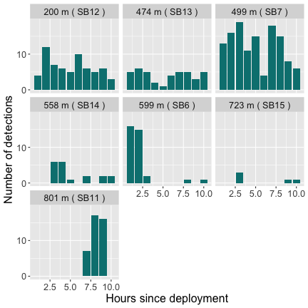

## Introduction

This vignette will walk you through the analyses presented in Winton et al. 2018, who describe the use of spatial point process models to estimate individual centers of activity from passive acoustic telemetry data. The vignette progresses from applying the simplest case, which assumes that detection probabilities/receiver detection ranges remain constant over time, to application of a test-tag integrated model, which incorporates detection data from one or more stationary test transmitters to estimate time-varying detection ranges. The models are fitted in a Bayesian framework using the Stan software (Carpenter et al. 2017); code was modified from that provided in Royle et al. 2013 for fitting spatial point process models to data from camera traps. We prefer the Bayesian approach for COA estimation due to its treatment of uncertainty, but realize the longer computational time required may be prohibitive for some applications. In the near future, we will update to include an option to fit in a maximum likelihood framework, which will reduce run times. We'd also like to note that the models described can support varying degrees of complexity - not all applications will require (or have the data to support) the most complex version of the model. The simpler the model, the shorter the run-time.

We realize that many users will have unique situations and may need to modify the base code to suit their purposes. Users can copy the `.stan` files contained in the `src/stan_files` folder to their local machine to do so. We will be happy to accommodate user requests (as our schedules allow). Our hope is to make this a collaborative package that will evolve based on the needs of the acoustic telemetry community and continue to improve over time. We have tried to make the instructions outlined in this vignette user-friendly since we are a group of applied biologists with varying degrees of statistical experience. If some of the statistical notation outlined here or in the paper remains unclear, feel free to contact us with questions/for clarification. Most of it is actually very intuitive, and we would like to make sure that comes through in the documentation. This is a new package, so if you find bugs, places where code efficiency could be improved, or instances where the documentation could be made more user-friendly, please let us know! 
 

## Data preparation

The package includes two data sets: 

1. 153 hours of detection data from a black sea bass (note that we have assigned time as the number of cumulative hours since the tag was deployed rather than providing the raw date/time stamp), and
2. hourly detections from a stationary test transmitter over the same time period. Two files containing the receiver coordinates and the location of the test tag are also included. We have provided the data in this format to illustrate data preparation specific to fitting these types of models; however, you will need to aggregate your date/time stamps to the time period of interest. Receiver and test tag coordinates provided are in the Universal Transverse Mercator (zone 18) projection, which have previously been mean-centered and scaled into kilometers. *This scaling step is highly recommended to reduce run-times. In other words, do it to your dataset prior to starting the code chunks here.*

To access the provided data, run:


``` r
library(TelemetrySpace)
library(dplyr)
library(tidyr)
library(ggplot2)
library(hexbin)
library(ggpubr)

rlocs # Receiver locations
#> # A tibble: 30 × 3
#>    Station   east  north
#>    <chr>    <dbl>  <dbl>
#>  1 SB1     -1.33  1.61  
#>  2 SB2     -0.579 1.91  
#>  3 SB3      0.219 2.00  
#>  4 SB4      1.00  1.81  
#>  5 SB5     -1.69  0.896 
#>  6 SB6     -0.879 0.950 
#>  7 SB7     -0.231 1.20  
#>  8 SB8      0.464 1.21  
#>  9 SB9      1.28  1.04  
#> 10 SB10    -1.77  0.0952
#> # ℹ 20 more rows
testloc # Test tag location
#> # A tibble: 1 × 2
#>     east north
#>    <dbl> <dbl>
#> 1 -0.329 0.713
head(testdat) # Hourly detection data from the test tag
#> # A tibble: 6 × 5
#>   Station Transmitter   east north  hour
#>   <chr>         <dbl>  <dbl> <dbl> <dbl>
#> 1 SB12           3447 -0.326 0.513     1
#> 2 SB13           3447  0.125 0.575     1
#> 3 SB7            3447 -0.231 1.20      1
#> 4 SB6            3447 -0.879 0.950     1
#> 5 SB13           3447  0.125 0.575     1
#> 6 SB6            3447 -0.879 0.950     1
head(fishdat) # Hourly detection data from a black sea bass
#> # A tibble: 6 × 5
#>   Station Transmitter   east north  hour
#>   <chr>         <dbl>  <dbl> <dbl> <dbl>
#> 1 SB15           3425  0.190 0.209     1
#> 2 SB14           3425 -0.261 0.159     1
#> 3 SB15           3425  0.190 0.209     1
#> 4 SB14           3425 -0.261 0.159     1
#> 5 SB12           3425 -0.326 0.513     1
#> 6 SB14           3425 -0.261 0.159     1
```

Prior to doing anything else, we need to specify our 'state space' - the spatial extent of interest. This will consist of your receiver array and a 'buffer' area around the array. The buffer needs to be large enough to allow for individuals that may have activity centers outside of the receiver array. There is no general rule of thumb for this, but it should scale with the geographic extent covered by your array. I would suggest selecting a buffer that is large enough to allow you to discriminate between individuals that are detected along the periphery of the array and individuals that are not detected at all - a COA will be estimated for all time steps unless you specify the individual has left the area; time steps with 0 detections will have an estimated COA somewhere outside the detection range of all receivers (note that this could be within the array bounds if your array has non-continuous coverage). If there are many time steps with zeros, you may want to modify your data file to omit time periods with 0 detections or modify the relevant `.stan` code chunk included in the `src/stan_files` folder on your local machine to skip time periods with no detections, which will speed up computing times. As always, it is up to the user to make sure that the results make sense in the context of the species/array of interest.


``` r
# Define state-space of point process - 'buffer' adds a fixed buffer to the outer extent of the recs
buffer <- 1
xlim <- c(min(rlocs$east - buffer), max(rlocs$east + buffer))
ylim <- c(min(rlocs$north - buffer), max(rlocs$north + buffer))
```

Next, we need to prepare our test tag data. First, calculate the distance between the test tag's location and each receiver. This can be done using the included 'distf' function.


``` r
# Set up a blank vector for storage
D <- NULL
# Loop over each hour
for (i in 1:nrow(testdat)) {
  D[i] <- distf(testloc[, c('east', 'north')], testdat[i, c('east', 'north')])
}

testdat$D <- unlist(D) # Assign to testdat data frame

# Plot to examine variation in detection rate over time
testdat |>
  count(Station, hour, D, east, north) |>
  mutate(
    dist = round(D * 1000), #Round distance for plotting
    label = paste(dist, "m", "(", Station, ")") #Create label by merging station name and distance
  ) |>

  #Plot using ggplot
  ggplot(aes(x = hour, y = n)) +
  geom_bar(stat = "identity", fill = '#008080') +
  facet_wrap(~ as.factor(label)) +
  theme(text = element_text(size = 16)) +
  scale_y_continuous(breaks = seq(0, 30, 10)) +
  labs(x = "Hours since deployment", y = "Number of detections")
```



Tally how many time intervals each receiver was operational for - this allows for individual receivers deployed for different periods and/or receivers that were lost.


``` r
# The full analysis takes several hours to run, so we'll subset out 10 hours to illustrate
fishdat <- fishdat |>
  filter(hour < 11)
testdat <- testdat |>
  filter(hour < 11)

# Create a copy of the receiver locations for tallying
rs <- rlocs

# Add column for each time interval to indicate whether receiver was operational or not
rs[, c(4:(max(fishdat$hour) + 3))] <- 1

# Create vector of the number of sampling occasions for each receiver
tsteps <- rowSums(rs[, 4:ncol(rs)])
tsteps # Will all be the same here because all operational over the entire time span
#>  [1] 10 10 10 10 10 10 10 10 10 10 10 10 10 10 10 10 10 10 10 10 10 10 10 10 10 10 10 10 10 10
```

Since detection records only include non-zero events (here assuming we'd like to keep time steps with zeros), we'll need to convert the number of detections to include zeros for all receivers that did not detect the tag during that time period.


``` r
## Starting with the test tag data
test_agg <- testdat |>
  mutate(
    rec = as.numeric(substr(Station, 3, 4)),
    # Add a column that indicates each record corresponds to 1 detection
    count = 1
  ) |>

  # Aggregate the number of detections for each individual at each receiver
  # in each time step
  count(Transmitter, rec, east, north, hour) |>

  # Create a numeric identifier for each transmitter
  mutate(tag = as.numeric(as.factor(Transmitter))) |>

  # Rename hour to time for consistency when plotting below
  rename(time = "hour")

# Specify quantities for indexing
#   number of individual tags (here just the one test tag)
ntest <- length(unique(test_agg$Transmitter))

#   number of receivers
nrec <- nrow(rlocs)

#   number of time steps
tsteps <- max(test_agg$time)

# This chunk saves the total number of encounters of each individual (rows) in
# each trap (cols) at each sampling occasion (array elements)
testY <- array(NA, dim = c(ntest, tsteps, nrec))

for (t in 1:tsteps) {
  for (i in 1:ntest) {
    h1 <- test_agg[test_agg$tag == i, ]

    for (j in 1:nrec) {
      testY[i, t, j] <- ifelse(
        # If there are no detections at that receiver in that time period, set to 0
        nrow(h1[h1$time == t & h1$rec == j, ]) == 0,
        0,

        # otherwise set to the number of detections
        h1[h1$time == t & h1$rec == j, ]$n
      )
    }
  }
}
```

Now we'll do the same thing for the black sea bass detection data. 


``` r
## Now do the same for each tagged fish
fish_agg <- fishdat |>
  mutate(
    rec = as.numeric(substr(Station, 3, 4)),
    # Add a column that indicates each record corresponds to 1 detection
    count = 1
  ) |>

  # Aggregate the number of detections for each individual at each receiver
  # in each time step
  count(Transmitter, rec, east, north, hour) |>

  # Create a numeric identifier for each transmitter
  mutate(tag = as.numeric(as.factor(Transmitter))) |>

  # Rename hour to time for consistency when plotting below
  rename(time = "hour")

# Specify quantities for indexing
#   number of individual tags (here just the one test tag)
nind <- length(unique(fish_agg$Transmitter))

# This chunk saves the total number of encounters of each individual (rows) in each trap (cols) at each sampling occasion (array elements)
Y <- array(NA, dim = c(nind, tsteps, nrec))

for (t in 1:max(tsteps)) {
  for (i in 1:nrow(Y)) {
    h1 <- fish_agg[fish_agg$tag == i, ]

    for (j in 1:nrow(rlocs)) {
      # If there are no detections at that receiver in that time period, set to 0; otherwise set to the number of detections
      Y[i, t, j] <- ifelse(
        # If there are no detections at that receiver in that time period, set to 0
        nrow(h1[h1$time == t & h1$rec == j, ]) == 0,
        0,

        # otherwise set to the number of detections
        h1[h1$time == t & h1$rec == j, ]$n
      )
    }
  }
}
```

We also want to make sure that our intial values of the COAs are realistic (somewhere within the array).


``` r
init_fun <- function() {
  list(
    sx = matrix(mean(rlocs$east), nrow = nind, ncol = tsteps),
    sy = matrix(mean(rlocs$north), nrow = nind, ncol = tsteps)
  )
}
```

## Fit the standard COA model  

After all of that data processing, we're finally ready to fit our model! We'll start by fitting the model assuming that detection probabilities are the same among all receivers and remain constant over time (As we all know, this will pretty much never be the case in 'real-life' but best to start simple). Besides, this model is handy when you don't have test-tag (or other) data available to inform detection probabilities but would like to be able to estimate COAs along the periphery of the array. The only other information you'll need to provide is the expected number of transmissions per tag per time interval (`ntrans` below).


