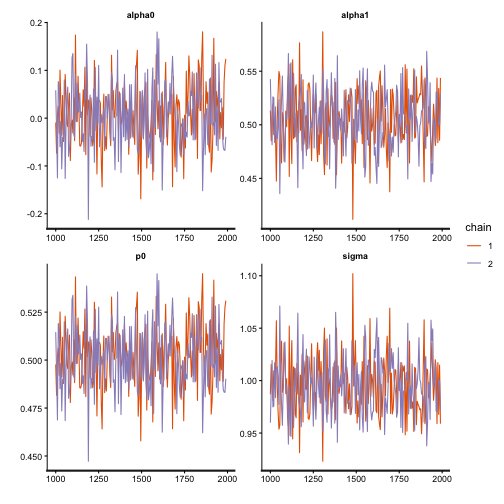
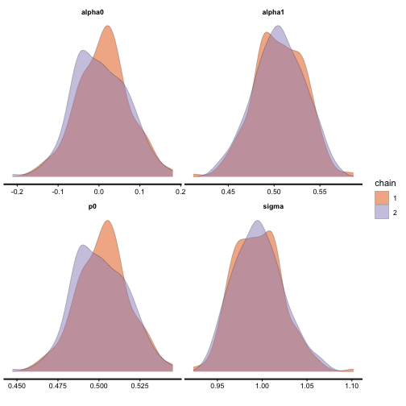
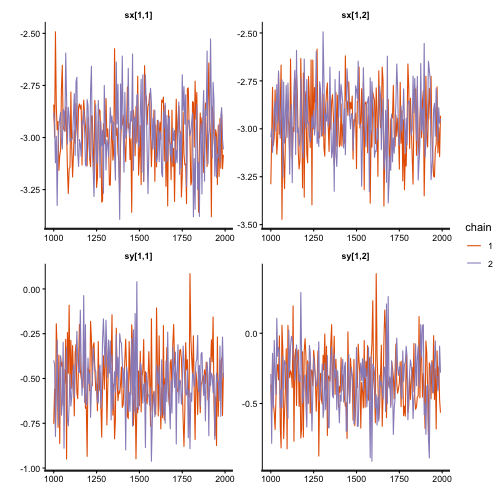
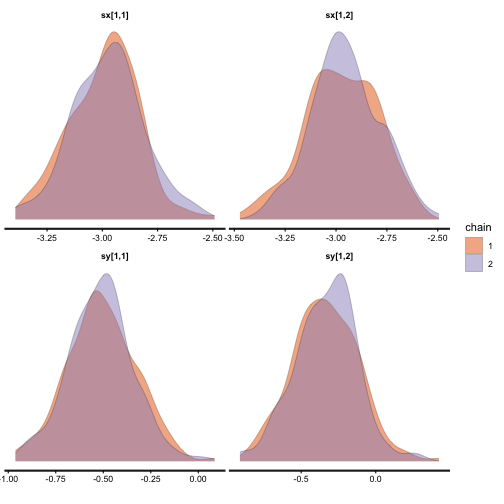
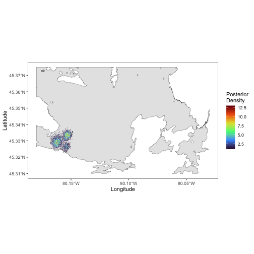
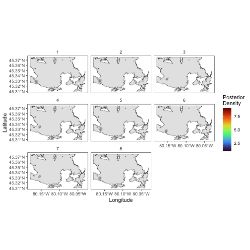

## Introduction

This vignette will walk you through the analyses presented in [Winton et al. 2018](https://besjournals.onlinelibrary.wiley.com/doi/full/10.1111/2041-210X.13080), who describes the use of spatial point process models to estimate individual centers of activity (COA) from passive acoustic telemetry data. This vignette progresses walks through how to prepare the data, using the model, and interpretating the results. We will be using the simplest case, which assumes that detection probabilities/receiver detection ranges remain constant over time, to a more complex application of a test-tag integrated model, that incorporates detection data from one or more stationary test transmitters to estimate time-varying detection ranges. The models are fitted in a Bayesian framework using the Stan software ([Carpenter et al. 2017](https://www.jstatsoft.org/article/view/v076i01/0)); code was modified from models found in [Royle et al. 2013](https://www.sciencedirect.com/book/monograph/9780124059399/spatial-capture-recapture) for fitting spatial point process models to data from camera traps. We prefer the Bayesian approach for COA estimation due to its treatment of uncertainty, but realize the longer computational time required may be prohibitive for some applications. We'd also like to note that the models described can support varying degrees of complexity - not all applications will require (or have the data to support) the most complex version of the model. The simpler the model, the shorter the run-time.

We have tried to make the instructions outlined in this vignette user-friendly since we are a group of applied biologists with varying degrees of statistical experience. If some of the statistical notation outlined here or in the paper remains unclear, feel free to contact us with questions for clarification. This is a new package, so if you find bugs, places where code efficiency could be improved, or instances where the documentation could be made more user-friendly, please let us know! 

## Models 
 
## Data preparation

To run spatial point process/detection probablity models in Stan we need to do a couple of things to our detection and receiver location data. This includes first providing the model with all the necessary information as well as in the proper format. Stan likes to handle data in vectors and arrays, which we don't often use in R, that are then provided to Stan in a `list`. To learn more about Stan, please click this [link](https://mc-stan.org/). Stan is written in C++, making it quite fast, with Stan programs following a very systematic order, see [link to understand a Stan program](). Stan uses [Markov chain Monte Carlo (MCMC)](https://en.wikipedia.org/wiki/Markov_chain_Monte_Carlo) and [No U-Turn Sampler (NUTS)](https://mc-stan.org/docs/2_18/stan-users-guide/sampling-difficulties-with-problematic-priors.html) to improve efficiency. We will now walk through how to setup the data to be able to run the models. 

We have serveral example datasets along with several functions to assist and streamline the data preparation. First we need to evaluate the positions of the receivers and create a [Azimuthal Equal Distance projection (aeqd)](https://en.wikipedia.org/wiki/Azimuthal_equidistant_projection). We use an aeqd project set in kilometers (km) for several reasons, the first being that in Stan it is very efficent to calcuate distances among receivers, however, the distance between receivers needs to be on the same x and y plain and ranges need to be between 0.2 - 15 km apart. The second is because....(Mike I need you to add stuff here as you know more about aeqd). We will be working with example data for a single Lake Trout (*Salvlinus namaycush*) that was implanted with an acoustic transmitter in Parry Sound which is a large embayment of Geogian Bay, Lake Huron. 

First we load all the packages needed to carry out the analysis.


``` r
{
  library(ggplot2)
  library(rstan)
  library(sf)
  library(TelemetrySpace)
}
```

### Receiver Locations 

Next we will look at the location of the receivers in Parry Sound. To build a aqed projection we need the locations to 
be in meters which we can transform these locations to a meter focused coordinate reference systme (crs), in this case UTMs. You will notice that `ps_rec_loc` is a `data.frame`. We need to make it into an `sf` object to then transforme it into UTMs and then build the aeqd projection. We 
can do this using `st_as_sf()` from [{sf}](https://r-spatial.github.io/sf/). 

``` r
# first look at the example
head(ps_rec_loc)
#> # A tibble: 6 × 3
#>   station_no deploy_lat deploy_long
#>   <chr>           <dbl>       <dbl>
#> 1 PSM-001          45.3       -80.1
#> 2 PSM-002          45.3       -80.1
#> 3 PSM-003          45.3       -80.1
#> 4 PSM-004          45.3       -80.2
#> 5 PSM-005          45.3       -80.2
#> 6 PSM-006          45.3       -80.2
str(ps_rec_loc)
#> tibble [80 × 3] (S3: tbl_df/tbl/data.frame)
#>  $ station_no : chr [1:80] "PSM-001" "PSM-002" "PSM-003" "PSM-004" ...
#>  $ deploy_lat : num [1:80] 45.3 45.3 45.3 45.3 45.3 ...
#>  $ deploy_long: num [1:80] -80.1 -80.1 -80.1 -80.2 -80.2 ...

# make it into a sf object

ps_rec_loc_sf <- ps_rec_loc |>
  st_as_sf(coords = c("deploy_long", "deploy_lat"), crs = 4326)
# next transform it into the correct utm

ps_rec_loc_utm <- ps_rec_loc_sf |>
  st_transform(32617)
```

Next we will build an aeqd projection for this receiver array that we can then transform the locations of the receivers into. 

``` r
aeqd_crs <- build_aeqd(ps_rec_loc_utm)
#> ✔ Successfully built "+proj=aeqd +lon_0=-80.124804 +lat_0=45.333008 +x_0=0 +y_0=0 +datum=WGS84 +units=km"
```

We then can transform the receiver locations into our aeqd project

``` r
ps_rec_loc_aeqd <- ps_rec_loc_sf |>
  st_transform(aeqd_crs) |>
  (\(.) .[order(.$station_no), ])()
```
Now that we the receiver locations transformed we need to first index them appropiately, this is because Stan will not be able to handel 
the `station_no` but instead can handle a numerical index value to identify the receivers. 

``` r
ps_rec_loc_aeqd$rec <- 1:nrow(ps_rec_loc_aeqd)
```

Next we will transform this into a `data.frame` the contains two `vectors` that we can supply to the Stan model. We also need to build 
the boundary box of the receiver array. The argument `buffer` in `build_bbox()` assumes a 1 km buffer but this can be changed depending on how you would like the boundary box to be created. 

``` r
rec_loc_vec <- build_rec_coords(ps_rec_loc_aeqd)

rec_limits <- build_bbox(rec_loc_vec)
```

### Detection Data 

Now that we have the receiver locations in a format that Stan can handle, we are going to prepare the detection data. First lets look at the detection data. 

``` r
head(ps_det_example)
#>   station_no detection_timestamp_utc tag_serial_no min_delay max_delay            time_bin time rec.x rec.y
#> 1    PSM-001     2024-05-04 02:09:48       1594061       190       290 2024-05-04 02:00:00    6     1     1
#> 2    PSM-001     2024-05-04 04:05:03       1594061       190       290 2024-05-04 04:00:00    8     1     1
#> 3    PSM-001     2024-05-04 03:37:50       1594061       190       290 2024-05-04 03:00:00    7     1     1
#> 4    PSM-002     2024-05-04 03:11:04       1594061       190       290 2024-05-04 03:00:00    7     2     2
#> 5    PSM-002     2024-05-04 02:40:09       1594061       190       290 2024-05-04 02:00:00    6     2     2
#> 6    PSM-002     2024-05-03 22:57:37       1594061       190       290 2024-05-03 22:00:00    2     2     2
str(ps_det_example)
#> 'data.frame':	577 obs. of  9 variables:
#>  $ station_no             : chr  "PSM-001" "PSM-001" "PSM-001" "PSM-002" ...
#>  $ detection_timestamp_utc: POSIXct, format: "2024-05-04 02:09:48" "2024-05-04 04:05:03" "2024-05-04 03:37:50" "2024-05-04 03:11:04" ...
#>  $ tag_serial_no          : chr  "1594061" "1594061" "1594061" "1594061" ...
#>  $ min_delay              : num  190 190 190 190 190 190 190 190 190 190 ...
#>  $ max_delay              : num  290 290 290 290 290 290 290 290 290 290 ...
#>  $ time_bin               : POSIXct, format: "2024-05-04 02:00:00" "2024-05-04 04:00:00" "2024-05-04 03:00:00" "2024-05-04 03:00:00" ...
#>  $ time                   : int  6 8 7 7 6 2 6 3 3 8 ...
#>  $ rec.x                  : int  1 1 1 2 2 2 2 2 2 2 ...
#>  $ rec.y                  : int  1 1 1 2 2 2 2 2 2 2 ...
```

We can notice that this detection data consists of 5 columns with 577 rows. To better understand what each field is you can run `?ps_det_example` to review the full documentation.

For our detection data, we have a few things we need to do, the first is we need to build a time bin that we will create COAs. For this data we are going to use 1 hour but this time bin can range from 30 mins - 1 day or more and depends on the questions you are asking and the species you are working with. 

Let's build our time bins


``` r
ps_det_example <- build_time_bin(ps_det_example, unit = "1 hour")
head(ps_det_example)
#>   station_no detection_timestamp_utc tag_serial_no min_delay max_delay            time_bin time rec.x rec.y
#> 1    PSM-007     2024-05-03 21:01:53       1594061       190       290 2024-05-03 21:00:00    1     7     7
#> 2    PSM-003     2024-05-03 21:01:54       1594061       190       290 2024-05-03 21:00:00    1     3     3
#> 3    PSM-004     2024-05-03 21:05:25       1594061       190       290 2024-05-03 21:00:00    1     4     4
#> 4    PSM-007     2024-05-03 21:05:25       1594061       190       290 2024-05-03 21:00:00    1     7     7
#> 5    PSM-008     2024-05-03 21:05:25       1594061       190       290 2024-05-03 21:00:00    1     8     8
#> 6    PSM-003     2024-05-03 21:05:26       1594061       190       290 2024-05-03 21:00:00    1     3     3
```

You will notice both a `POSIXct` column that is called `time_bin` and a numerical column called `time`. This `time` column is a numerical index of the time bins. 

We have a few more things we need to do to prepare the data, first we need to add in the numerical index of the receiver values that we created in the first section. We can do this by using `merge()` from base or we want we could use `left_join()` from `{dplyr}` or `merge.data.table()` from `{data.table}`. 

``` r
ps_det_example <- merge(
  ps_det_example,
  st_drop_geometry(ps_rec_loc_aeqd),
  by = "station_no"
)
head(ps_det_example)
#>   station_no detection_timestamp_utc tag_serial_no min_delay max_delay            time_bin time rec.x rec.y rec
#> 1    PSM-001     2024-05-04 02:09:48       1594061       190       290 2024-05-04 02:00:00    6     1     1   1
#> 2    PSM-001     2024-05-04 04:05:03       1594061       190       290 2024-05-04 04:00:00    8     1     1   1
#> 3    PSM-001     2024-05-04 03:37:50       1594061       190       290 2024-05-04 03:00:00    7     1     1   1
#> 4    PSM-002     2024-05-04 03:11:04       1594061       190       290 2024-05-04 03:00:00    7     2     2   2
#> 5    PSM-002     2024-05-04 02:40:09       1594061       190       290 2024-05-04 02:00:00    6     2     2   2
#> 6    PSM-002     2024-05-03 22:57:37       1594061       190       290 2024-05-03 22:00:00    2     2     2   2
```
We are starting to get somewhere, you can see that we now have the time and recevier index values lined up. The last two things we need to do is first determine the numer of individuals, in this case it will be 1 and the expetected number of detections for invidiaul for each receiver for each time bin, and the number of transmissions this is where `min_delay` and `max_delay` come into play. We do suggest running the model for each invidual with modeling large time periods for example 1 year's worth of data being broken down into 7 day chunks.  

Lets build the count data and the number of time steps in the data. 


``` r
ps_count_example <- build_counts(
  df = ps_det_example,
  nrec = nrow(ps_rec_loc_aeqd),
  rec_id = ps_rec_loc_aeqd$rec,
  rec_names = ps_rec_loc_aeqd$station_no
)

time_steps <- build_tstep(ps_count_example)
#> ✔ Successfully built the number of time steps 8
```

Now we can create the number of inviduals and the number of transmisisons expected within the time bin. 

``` r
nind <- length(unique(ps_det_example$tag_serial_no))

ntrans <- build_ntrans(ps_det_example)
#> ✔ Successfully built the number of transmission 15 expectd in "1 hour(s)" bins based off of
#> "mean delay".
```

We can finally move on to running the model, however, we need to understand a bit more about Bayesian frameworks before we proceed.

## Bayesian Analysis

We can now estimate the center of activity for lake trout in Parry Sound, Lake Huron. 

There are a few things to know about running a Bayesian analysis, I suggest reading these resources:

1.  [Basics of Bayesian Statistics - Book](https://statswithr.github.io/book/)
2.  [A Student’s Guide to Bayesian Statistics by Ben Lambert](https://sites.math.rutgers.edu/~zeilberg/EM20/Lambert.pdf)
3.  [Statistical rethinking 2 with rstan and the tidyverse by Solomon Kurz](https://solomon.quarto.pub/sr2rstan/)
4.  [Fitting Bayesian Models using Stan and R by Dan Ovando](https://www.weirdfishes.blog/blog/fitting-bayesian-models-with-stan-and-r/)
5.  [Andrew Proctor's - Module 6](https://andrewproctor.github.io/rcourse/module6.html)
6.  [van de Schoot et al., (2021)](https://www.nature.com/articles/s43586-020-00001-2)

### Priors

Bayesian analyses rely on supplying uninformed or informed prior distributions for each parameter (coefficient; predictor) in the model. For the puproses of the deteciton probablity model the following priors are assumed and are not adjustable. 


### Model convergence

It is important to always run the model with at least 2 chains. If the model does not converge you can try to increase the following:

1.  The amount of samples that are discarded; this can be controlled by the argument `warmup`.

2.  The number of iterative samples retained; this can be controlled by the argument `iter`.

3.  The number of samples drawn (in this is controlled by the argument `thin`). 
    This will also reduce the size the posterior distribution kept. 

4.  The `adapt_delta` value using `control = list(adapt_delta = 0.95)`.

When assessing the model we want $\hat R$ to be 1 or within 0.05 of 1, which indicates that the variance among and within chains are equal (see [{rstan} documentation on $\hat R$](https://mc-stan.org/rstan/reference/Rhat.html)), a high value for effective sample size (ESS), trace plots to look "grassy" or "caterpillar like," and posterior distributions to look relatively normal.

## Model 
We can now run the standard point process/detection probablity model. 

``` r
m <- COA_Standard(
  nind = nind,
  nrec = nrow(ps_rec_loc_aeqd),
  ntime = time_steps,
  ntrans = ntrans,
  y = ps_count_example,
  recX = rec_loc_vec$recX,
  recY = rec_loc_vec$recY,
  xlim = rec_limits$xlim,
  ylim = rec_limits$ylim,
  chains = 2,
  thin = 5
)
#> 
#> SAMPLING FOR MODEL 'COA_Standard_gaussian' NOW (CHAIN 1).
#> Chain 1: 
#> Chain 1: Gradient evaluation took 0.001083 seconds
#> Chain 1: 1000 transitions using 10 leapfrog steps per transition would take 10.83 seconds.
#> Chain 1: Adjust your expectations accordingly!
#> Chain 1: 
#> Chain 1: 
#> Chain 1: Iteration:    1 / 2000 [  0%]  (Warmup)
#> Chain 1: Iteration:  200 / 2000 [ 10%]  (Warmup)
#> Chain 1: Iteration:  400 / 2000 [ 20%]  (Warmup)
#> Chain 1: Iteration:  600 / 2000 [ 30%]  (Warmup)
#> Chain 1: Iteration:  800 / 2000 [ 40%]  (Warmup)
#> Chain 1: Iteration: 1000 / 2000 [ 50%]  (Warmup)
#> Chain 1: Iteration: 1001 / 2000 [ 50%]  (Sampling)
#> Chain 1: Iteration: 1200 / 2000 [ 60%]  (Sampling)
#> Chain 1: Iteration: 1400 / 2000 [ 70%]  (Sampling)
#> Chain 1: Iteration: 1600 / 2000 [ 80%]  (Sampling)
#> Chain 1: Iteration: 1800 / 2000 [ 90%]  (Sampling)
#> Chain 1: Iteration: 2000 / 2000 [100%]  (Sampling)
#> Chain 1: 
#> Chain 1:  Elapsed Time: 12.481 seconds (Warm-up)
#> Chain 1:                14.039 seconds (Sampling)
#> Chain 1:                26.52 seconds (Total)
#> Chain 1: 
#> 
#> SAMPLING FOR MODEL 'COA_Standard_gaussian' NOW (CHAIN 2).
#> Chain 2: 
#> Chain 2: Gradient evaluation took 0.001018 seconds
#> Chain 2: 1000 transitions using 10 leapfrog steps per transition would take 10.18 seconds.
#> Chain 2: Adjust your expectations accordingly!
#> Chain 2: 
#> Chain 2: 
#> Chain 2: Iteration:    1 / 2000 [  0%]  (Warmup)
#> Chain 2: Iteration:  200 / 2000 [ 10%]  (Warmup)
#> Chain 2: Iteration:  400 / 2000 [ 20%]  (Warmup)
#> Chain 2: Iteration:  600 / 2000 [ 30%]  (Warmup)
#> Chain 2: Iteration:  800 / 2000 [ 40%]  (Warmup)
#> Chain 2: Iteration: 1000 / 2000 [ 50%]  (Warmup)
#> Chain 2: Iteration: 1001 / 2000 [ 50%]  (Sampling)
#> Chain 2: Iteration: 1200 / 2000 [ 60%]  (Sampling)
#> Chain 2: Iteration: 1400 / 2000 [ 70%]  (Sampling)
#> Chain 2: Iteration: 1600 / 2000 [ 80%]  (Sampling)
#> Chain 2: Iteration: 1800 / 2000 [ 90%]  (Sampling)
#> Chain 2: Iteration: 2000 / 2000 [100%]  (Sampling)
#> Chain 2: 
#> Chain 2:  Elapsed Time: 13.17 seconds (Warm-up)
#> Chain 2:                14.126 seconds (Sampling)
#> Chain 2:                27.296 seconds (Total)
#> Chain 2: 
#>         warmup sample
#> chain:1 12.481 14.039
#> chain:2 13.170 14.126
```


We can inspect the model object with the first object containing the Stan model object (accessible via `m$model`, which will allow you to use `rstan` plotting tools and diagnostic plots - see rstan documentation for details).

``` r
summary(m)
#>                      Length Class         Mode   
#> model                 1     stanfit       S4     
#> summary              20     -none-        numeric
#> time                  1     -none-        numeric
#> summary_draws         4     draws_summary list   
#> coas                  8     tbl_df        list   
#> all_estimates        24     draws_df      list   
#> loc_draws             8     tbl_df        list   
#> param_draws          10     tbl_df        list   
#> generated_quantities  1     -none-        list
```

Let's look at our trace plots for the model parameters and posterior distrubitons to ensure the model converged proeprly. 


``` r
stan_trace(m$model, pars = c("alpha0", "alpha1", "p0", "sigma"))
```



``` r

stan_dens(
  m$model,
  pars = c("alpha0", "alpha1", "p0", "sigma"),
  separate_chains = TRUE,
  linewidth = 0.1
)
```



We can see our trace plots look good and that the posterior distributions of our paramaters look good. 

Next lets look at our latent variables which are `sx` and `sy` or the estiamted locations of the fish based on
the detection probablity. For large/lengthy time periods it will become cumbersome to evaluate the posteriors 
this way and we recommend inspecting $\hat R$ and ESS. 


``` r
stan_trace(m$model, pars = c("sx[1,1]", "sx[1,2]", "sy[1,1]", "sy[1,2]"))
```



``` r

stan_dens(
  m$model,
  pars = c("sx[1,1]", "sx[1,2]", "sy[1,1]", "sy[1,2]"),
  separate_chains = TRUE,
  linewidth = 0.1
)
```


Again we can see that everything looks good and our model has converted. 

Now moving on to the other elements in the outputed object from `COA_*()`. 

The second element is a table of parameter estimates, `p0` which is the estimated detection probality at distance of 0 m and the standard deviation (`sigma`). Their mean, standard error of the mean, and the associated quantiles from the posterior distriubtions. The table also includes the effective sample size and the Rhat statistic (which should be between 0.95 and 1.05).


``` r
m$summary
#>            mean      se_mean         sd      2.5%       25%       50%       75%     97.5%    n_eff      Rhat
#> p0    0.5017962 0.0008141849 0.01641961 0.4706865 0.4899284 0.5017741 0.5124778 0.5328783 406.7051 0.9988061
#> sigma 0.9956858 0.0013891113 0.02758764 0.9492251 0.9735344 0.9946078 1.0132799 1.0547409 394.4163 0.9980837
```

We can see that the mean detection probablity at a distance of 0 m is 0.5 or 50% and that the model converged well for this paramaters. 

The thrid element returned, is the time required to run the model in minutes. Note that Stan will automatically detect and use multiple cores. If the computer used to run this has multiple cores, the time returned will be longer than the actual run time. This is because it will sum the time for each core. To return the realized run time, divide `fit$time` by the number of cores.


``` r
m$time
#> [1] 0.8969333
```


The fouth element returned, is a summary of the posterior draws. Returned is the `variable`, `median`, and the 2.5 and 97.5% quartiles (e.g., `q2.5` and `q97.5`). This summary `data.frame` provides you the ability to inspect all elements, however, most of the time a you will be using this information that has been filtered and displayed in a more user frinedly manner in futher objects returned by `COA_*()` functions. 


``` r
m$summary_draws
#> # A tibble: 21 × 4
#>    variable   median   q2.5  q97.5
#>    <chr>       <dbl>  <dbl>  <dbl>
#>  1 alpha0    0.00710 -0.117  0.132
#>  2 alpha1    0.505    0.449  0.555
#>  3 sx[1,1]  -2.97    -3.31  -2.65 
#>  4 sx[1,2]  -2.97    -3.32  -2.64 
#>  5 sx[1,3]  -2.12    -2.37  -1.94 
#>  6 sx[1,4]  -2.27    -2.52  -2.02 
#>  7 sx[1,5]  -2.79    -3.07  -2.46 
#>  8 sx[1,6]  -2.30    -2.53  -2.06 
#>  9 sx[1,7]  -2.29    -2.52  -2.08 
#> 10 sx[1,8]  -2.99    -3.26  -2.74 
#> # ℹ 11 more rows
```

The fourth returns `data.frame` of the median values for the latent variables `sx` and `sy` which are the estimated location of the fish. The median values can be viewed as the center of activity while the posterior distibution is the uncertainity around that estimate. The `data.frame` has a few important compoents `ind` is the index number of the invidiaul, `time` is the index number for a given time bin, `x` and `y` are the median values for a given individual and time, while `x_*` and `y_*` are the 2.5 and 97.5% quantiles for those posteriors, this effectivively is viewed as the 95% credible interval (Bayesian version of a confidence interval) for each coordinate.


``` r
m$coas
#> # A tibble: 8 × 8
#>     ind  time     x       y x_lower x_upper y_lower y_upper
#>   <int> <int> <dbl>   <dbl>   <dbl>   <dbl>   <dbl>   <dbl>
#> 1     1     1 -2.97 -0.519    -3.31   -2.65 -0.866  -0.167 
#> 2     1     2 -2.97 -0.329    -3.32   -2.64 -0.749   0.0615
#> 3     1     3 -2.12  0.0622   -2.37   -1.94 -0.143   0.269 
#> 4     1     4 -2.27  0.155    -2.52   -2.02 -0.0977  0.398 
#> 5     1     5 -2.79 -0.281    -3.07   -2.46 -0.687   0.0842
#> 6     1     6 -2.30 -0.735    -2.53   -2.06 -1.04   -0.463 
#> 7     1     7 -2.29 -0.107    -2.52   -2.08 -0.321   0.115 
#> 8     1     8 -2.99 -0.472    -3.26   -2.74 -0.737  -0.209
```

The fith element (`m$all_estimates`) contains the posterior draws from each non-warm-up iteration from all chains. If you're not familiar with Bayesian terminology all you need to know is that this contains disturbtions for each paramter and latent variable for each individual in each time step. It is unlikely that you will use this object instead we have created futher objects below that you are more likely to use. 


``` r
m$all_estimates
#> # A draws_df: 200 iterations, 2 chains, and 21 variables
#>     alpha0 alpha1 sx[1,1] sx[1,2] sx[1,3] sx[1,4] sx[1,5] sx[1,6]
#> 1  -0.0734   0.48    -3.0    -3.0    -2.2    -2.1    -2.8    -2.3
#> 2   0.0079   0.50    -2.5    -2.8    -2.0    -2.2    -2.8    -2.1
#> 3   0.0249   0.52    -2.8    -3.1    -2.1    -2.2    -2.6    -2.4
#> 4  -0.0317   0.49    -3.0    -3.0    -2.1    -2.1    -2.9    -2.3
#> 5   0.1004   0.51    -2.9    -2.8    -2.2    -2.4    -2.9    -2.3
#> 6   0.0291   0.49    -3.2    -3.0    -2.2    -2.4    -2.9    -2.4
#> 7  -0.0358   0.45    -3.1    -3.1    -2.3    -2.3    -2.9    -2.4
#> 8   0.0476   0.50    -3.1    -3.1    -2.1    -2.2    -2.8    -2.2
#> 9  -0.0488   0.53    -2.8    -2.7    -2.0    -2.0    -2.5    -2.3
#> 10 -0.0244   0.55    -2.7    -3.0    -2.1    -2.0    -2.8    -2.0
#> # ... with 390 more draws, and 13 more variables
#> # ... hidden reserved variables {'.chain', '.iteration', '.draw'}
```

The sixth element (`m$loc_draws`), contains an extracted and transformed posterior draws 
for the latent variables `sx` and `sy`. This object we will use to plot our estimates of 
centers of activity. There are several other columns besides, the draw (i.e, `x`, `y`), the 
`fish`/ind index number and the `time` index number. We have `.chain`, `.itteration`, `.draw` which identifies the chain, iteration, and draw that posterior draw came from. We also 
have the column `lp__` which is the unnormalized log posterior density of your model, used for diagnosing sampling efficiency, estimating approximations, and comparing models.

We are going to inspect this element and then plot it. 

``` r
loc_draws <- m$loc_draws
loc_draws
#> # A tibble: 3,200 × 8
#>    .chain .iteration .draw   lp__  fish  time     x       y
#>     <int>      <int> <int>  <dbl> <int> <int> <dbl>   <dbl>
#>  1      1          1     1 -1281.     1     1 -3.00 -0.560 
#>  2      1          1     1 -1281.     1     2 -3.05 -0.552 
#>  3      1          1     1 -1281.     1     3 -2.18  0.108 
#>  4      1          1     1 -1281.     1     4 -2.09  0.265 
#>  5      1          1     1 -1281.     1     5 -2.79 -0.208 
#>  6      1          1     1 -1281.     1     6 -2.33 -0.388 
#>  7      1          1     1 -1281.     1     7 -2.28 -0.0152
#>  8      1          1     1 -1281.     1     8 -3.00 -0.433 
#>  9      1          2     2 -1291.     1     1 -2.49 -0.771 
#> 10      1          2     2 -1291.     1     2 -2.78 -0.176 
#> # ℹ 3,190 more rows
```

Next we are going to plot the posterior draws for locations. Within the package we 
have a `sf` object that is the shape of Parry Sound that we plot this onto so we can understand where the fish was during each time period. 

First though we need to take that `sf` object and transform it into an aeqd projection. 

``` r
ps_aeqd <- ps |>
  st_transform(aeqd_crs)
```

Now we can plot this within in our system both combined and broken up by time.

``` r
p <- ggplot() +
  geom_sf(data = ps_aeqd) +
  geom_hex(data = loc_draws, aes(x = x, y = y), bins = 50) +
  scale_fill_viridis_c(option = "H", name = "Posterior\nDensity") +
  scale_x_continuous(n.breaks = 4) +
  theme_bw() +
  theme(
    panel.grid = element_blank(),
    strip.background = element_blank()
  ) +
  labs(
    x = "Longitude",
    y = "Latitude"
  )

p1 <- p +
  facet_wrap(~time)

p
```



``` r
p1
```


